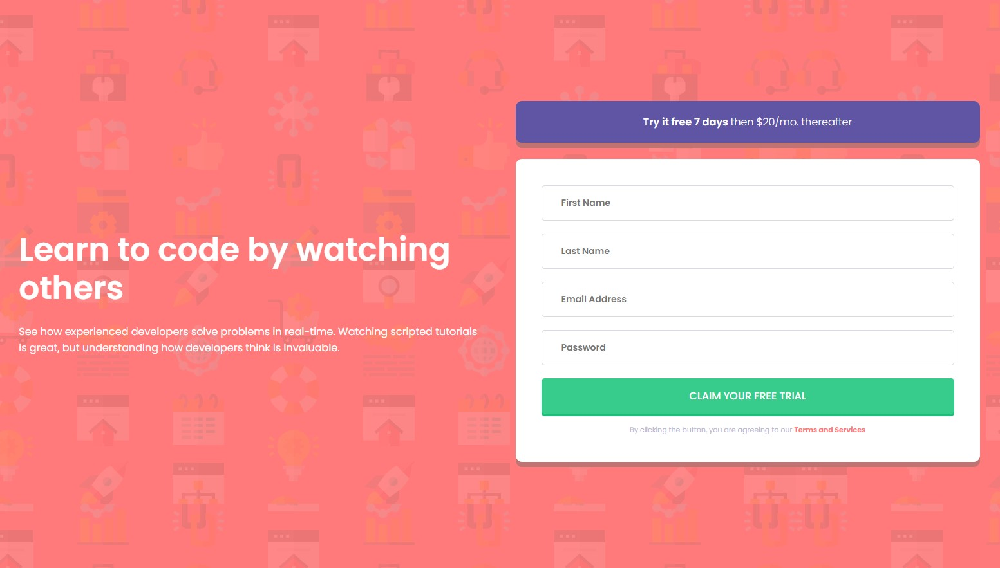

# Frontend Mentor - Intro component with sign up form solution

This is a solution to the [Intro component with sign up form challenge on Frontend Mentor](https://www.frontendmentor.io/challenges/intro-component-with-signup-form-5cf91bd49edda32581d28fd1). Frontend Mentor challenges help you improve your coding skills by building realistic projects.

## Table of contents

- [Overview](#overview)
  - [Screenshot](#screenshot)
  - [Links](#links)
- [My process](#my-process)
  - [Built with](#built-with)
  - [Useful resources](#useful-resources)
- [Author](#author)

## Overview

### Screenshot

### Links

- Solution URL: https://github.com/mateusz-przybyla/Intro-component-with-sign-up-form
- Live Site URL: https://mateusz-przybyla.github.io/Intro-component-with-sign-up-form/

## My process

### Built with

- Semantic HTML5 markup
- Vanilla CSS
- Flexbox
- Mobile-first workflow
- Vanilla JavaScript: querySelector(), getElementById(), addEventListener(), add() methods

### Useful resources

- [Web Development Bootcamp](https://www.udemy.com/course/the-complete-web-development-bootcamp/?couponCode=KEEPLEARNING) - The Web Development Bootcamp in which I am taking part.
- [MDN Web Docs](https://developer.mozilla.org/en-US/) - My best website which help me understand rules and features about HTML, CSS and JavaScript languages.

## Author

- Frontend Mentor - [@mateusz-przybyla](https://www.frontendmentor.io/profile/mateusz-przybyla)
